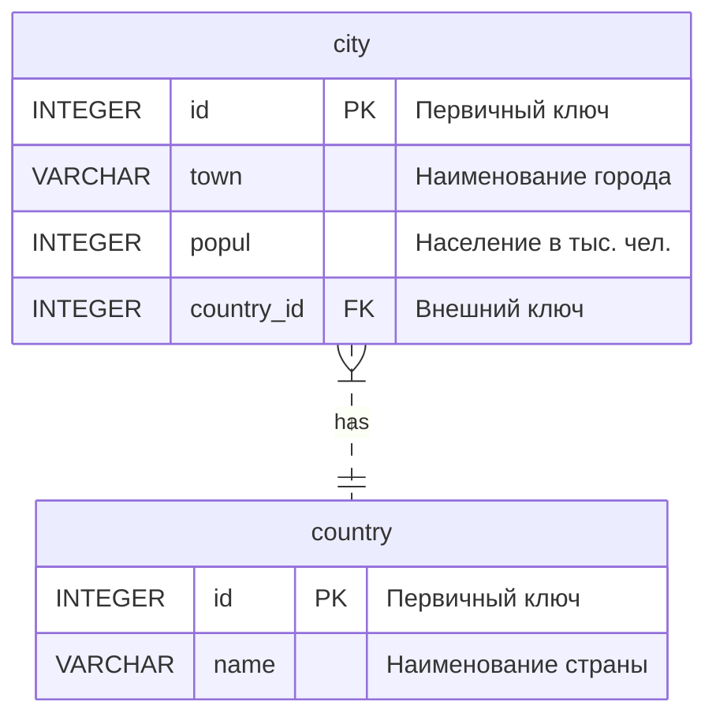
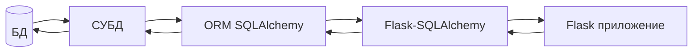

# Реализация #

### Структура проекта ###

>+ town_db\  
>  + doc\
>  + static\
>    + css\
>      + _bootstrap.min.css_
>      + _style.css_
>    + img\
>      + _favicon.ico_
>      + _Night-City.png_
>      + pattern.png
>    + js\
>      + _bootstrap.bundle.min.js_
>  + templates\
>    + _404.html_
>    + _500.html_
>    + _base.html_
>    + _catalog.html_
>    + _catalogcity.html_
>    + _find.html_
>    + _index.html_
>  + _CODEME.MD_
>  + _config.py_
>  + _myapp.db_
>  + _myapp.py_
>  + _README.md_
>  + _requirements.txt_  

| Директория/файл                                       | Описание                                                                                                                                                                                                                                              |
|-------------------------------------------------------|:------------------------------------------------------------------------------------------------------------------------------------------------------------------------------------------------------------------------------------------------------|
| doc\                                                  | Графические файлы для документации, не влияющие на работу проекта                                                                                                                                                                                     |
| static\                                               | Для хранения статических файлов. Статические файлы — это файлы, которые не изменяются часто. Это, например, файлы CSS, JavaScript, шрифты и так далее. По умолчанию Flask ищет статические файлы в папке static, которая хранится в папке приложения. |
| templates\                                            | Для хранения шаблонов. По умолчанию, Flask ищет шаблоны в подкаталоге templates внутри папки приложения.                                                                                                                                              |
| config.py                                             | Настройки Flask. Для работы форм, для подключения к БД и т.д.                                                                                                                                                                                         |
| myapp.py                                              | Файл с самим приложением (контролеры, формы, модель).                                                                                                                                                                                                 |
| myapp.db                                              | База данных SQLite                                                                                                                                                                                                                                    |
| bootstrap.min.css  bootstrap.bundle.min.js            | Необходимы для работы HTML, CSS и JS фреймворка Bootstrap5                                                                                                                                                                                            |
| style.css                                             | Дополительные стили CSS, в частности формы, "шапка", "подвал".                                                                                                                                                                                        |
| requirements.txt                                      | Файл зависимостей, из которого можно установить все необходимые модули                                                                                                                                                                                |
| base.html                                             | Базовый шаблон, в котором задействован механизмом расширения (наследования) шаблона для создания дочерних страниц .                                                                                                                                   |
| 404.html, 500.html                                    | Дочерние шаблоны, с выводом ошибок 404 (File Not Found) и 500 (An unexpected error has occurred)                                                                                                                                                      |
| catalog.html, catalogcity.html, find.html, index.html | Дочерние шаблоны в которых расширяется базовый шаблон. Нужны для создания страниц "Главная", "Поиск", "Справочник городов", "Справочник стран".                                                                                                       |
### config.py ###   
Конфигурация Flask вынесена в отдельный файл. Параметры конфигурации определяются как переменные класса Configuration.   
* SECRET_KEY - модули Flask используют значение секретного ключа в качестве криптографического ключа,  для генерации подписей или токенов. Flask-WTF использует его для защиты веб-форм.
Значение ключа берётся из переменной окружения 'SECRET_KEY' или из строки 'MY_Secret_Key'.
Строку, для безопасности, естественно нужно переделать.
* SQLALCHEMY_TRACK_MODIFICATIONS - включает/отключает функцию Flask-SQLAlchemy, которая сигнализирует приложению каждый раз, когда в базе данных должно быть внесено изменение.
* SQLALCHEMY_DATABASE_URI - местоположение базы данных, используется модулем Flask-SQLAlchemy. 
* DEBUG - включает/отключает отладчик Flask. На боевом сервере ставим False.
```python
import os
class Configuration(object):
    SQLALCHEMY_DATABASE_URI = 'sqlite:///myapp.db'
    SQLALCHEMY_TRACK_MODIFICATIONS = False
    SECRET_KEY = os.environ.get('SECRET_KEY') or 'MY_Secret_Key'
    DEBUG = True
```
Подключается класс Configuration из модуля config в файле myapp.py.
```python
from config import Configuration
```  
### myapp.py ###  
#### Модель ###
В качестве СУБД выбрана SQLite, т.к. она устанавливается вместе с Python`ом и проект по определению не является высоконагруженным.
Диаграмма БД приведена ниже. Имеется две сущности - country и city, приведено к третьей нормальной форме (3NF).  
Связь один ко многим. Одна страна может иметь в своём составе один и более городов. С другой стороны один город принадлежит одной стране. Будем абстрактно считать так (хотя возможны исключения, например Берлин до 1990 года - ФРГ и ГДР).
##### Схема базы данных #####  

Данные, хранимые в БД, будут представлены набором классов, называемые моделями баз данных. Для этого будет использоваться [ORM](https://ru.wikipedia.org/wiki/ORM) SQLAlchemy, точнее её надстройка заточенная для работы с Flask - Flask-SQLAlchemy.  Графически изобразить можно так:


Имеется два класса с атрибутами Country и City, которые обеспечивают работу с данными в терминах классов, а не таблиц данных _country_ и _city_, и, наоборот, преобразовывают термины и данные классов в данные, для хранения в СУБД.  

Обращаю внимание на конструкторы классов, в них должны быть описаны все атрибуты, кроме id, иначе, возникнут трудности при сохранении новой записи. Метод `__repr__` сообщает Python, как выводить на печать объекты этого класса.
```python
class Country(db.Model):
    id = db.Column(db.Integer, primary_key=True)
    name = db.Column(db.String(80), unique=True, nullable=True)

    def __init__(self, name):
        self.name = name

    def __repr__(self):
        return f"<country {self.id} - {self.name}>"


class City(db.Model):
    id = db.Column(db.Integer, primary_key=True)
    town = db.Column(db.String(100), unique=True, nullable=True)
    popul = db.Column(db.Integer, unique=True, nullable=True)

    def __init__(self, town, popul, country_id):
        self.town = town
        self.popul = popul
        self.country_id = country_id

    country_id = db.Column(db.Integer, db.ForeignKey('country.id'))
    pr = db.relationship('Country', backref=db.backref('City', lazy='dynamic'))

    def __repr__(self):
        return f"<city {self.id}>"
```