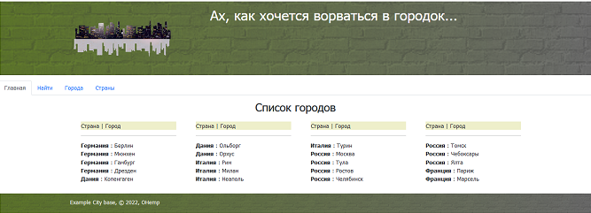
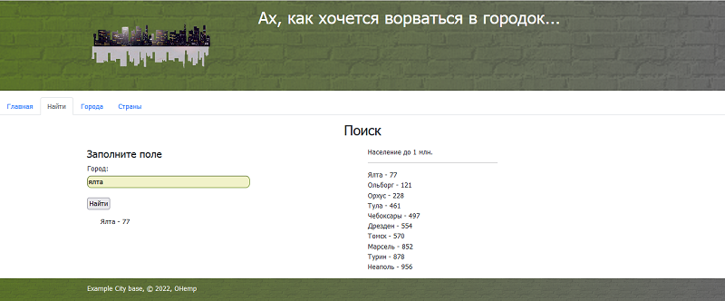
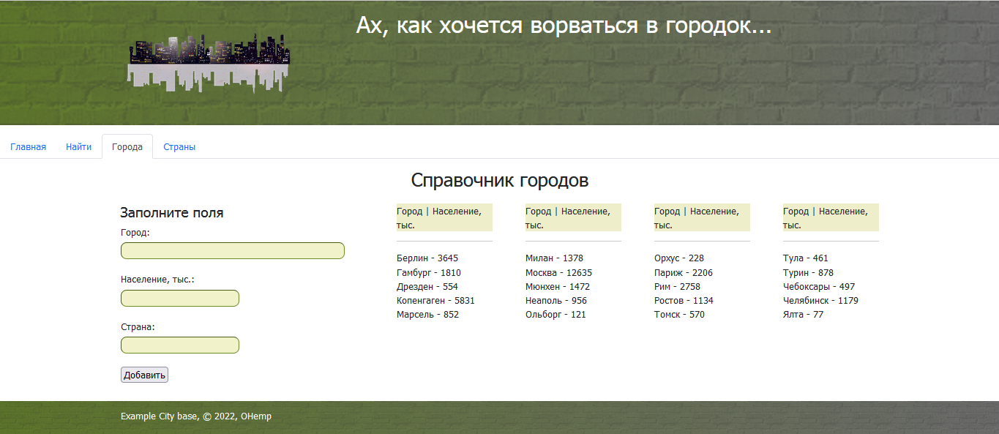
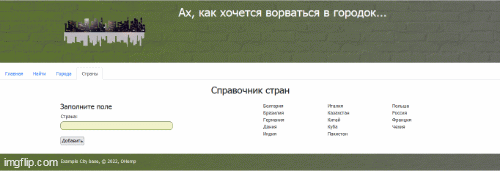

# База городов town_db #

## Введение ## 
***
Идея, поданая Ильёй Лагода , подключить Flask, настроить формы для работы со списком городов (`{страна: [город1, город2...]}`), хранящимся в JSON файле, трансформировалась, в идёю создать базу городов на SQLite3, Flask и с использованием модуля flask_sqlalchemy. В итоге, получился учебный проект, где был получен навык работы с микрофреймворком <b>Flask</b>, с СУБД <b>SQLite3</b>, c  HTML, CSS и JS фреймворком <b>Bootstrap5</b>.

## Установка ##
***
<li>Устанавливаем Python 3 для своей системы, если не установлен.
 Для ОС Windows переходим по ссылке и устанавливаем - <a href="https://www.python.org/downloads/">Python.org</a>.
Для Ubunty/Debian Python должен быть установлен по умолчанию. 
<br>Проверим в терминале версию, установленного Python:
 
`python -v`
</li>

<li> Установливаем систему управления пакетов pip, если, она не установлена.</li>
<li>Создаём виртуальное окружение с помощью venv, позволяющей создавать изолированные среды для отдельных проектов Python, решая тем самым проблему зависимостей и совместимости приложений разных версий. Ниже, env - это директория создаётся виртуальное окружение.

###### Для Windows:  ######
```
-m venv env   
env\Scripts\activate 
```
###### В Ubunty/Debian: ###### 

```
$ python3 -m venv env  

$ . env/bin/activate
```
</li>
<li>Устанавливаем модули из файла зависимостей:  

`pip install -r requirements.txt`</li>


## Описание работы ##
***
Проект учебный, наполнять БД, большим количеством информации бессмысленная  трата времени.
Поэтому, в базе фигурируют всего три сущности:
- Страна
- Город
- Население  

Создано четыре страницы:
- Главная
- Найти
- Города
- Страны

### Создание новой базы  ###
Если возникнет необходимость в создание "чистой" базы, то необходимо раскомментировать строчку
в файле myapp.py:
`db.create_all()`
Запустить Flask, будет создана БД, закомментировать строку, и перезапустить Flask.

### Главная ###
  
На главной странице выведена информация в формате _страны : города_ . Вывод осуществлён в четыре колонки.
### Найти ###
  
Реализован поиск по городу. Города, можно вводить с маленьких букв.  
Также в качестве, примера сделана выборка по населению городов менее 1 млн человек..
### Города ###
  
В форме вводятся название города, страны и население этого города в тысячах человек.
В форме реализована валидация вводимых данных, проверка на налиие в базе вводимого города, проверка на ниличие страны в базе данных.
 Первая буква у города и страны, необязательно должна быть заглавной.  
Также осуществлён вывод городов в четыре колонки.


### Страны ###
  
Через форму, заполняется стправочник стран. Эффективней было бы спарсить список всех стран, но цель была поработать 
с формами, даёшь больше интерактива!!!  
В форме реализована валидация вводимых данных, проверка на налиие в базе вводимой страны. Первая буква, необязательно должна быть заглавной.

## Прочее ##

[Реализация](./CODME.MD)

## Используемый материал ##
***
<ul>
<li><a href="https://flask-sqlalchemy.palletsprojects.com/en/2.x/">Flask-SQLAlchemy</a></li>
<li><a href="https://habr.com/ru/post/346306/">Хабр:Мега-Учебник Flask ( издание 2018 ) </a></li>
<li><a href="https://proproprogs.ru/flask">proproprogs.ru</a></li>
<li><a href="https://900913.ru/2021/01/03/example-database-and-python-3-sqlalchemy-orm/">Три примера работы с SQL базой данных в Python (sqlalchemy.orm)</a></li>
<li><a href="https://www.youtube.com/watch?v=lBOq1_blG_8">Flask: подключаем БД, настраиваем SqlAlchemy</a></li>
<li><a href="https://www.youtube.com/watch?v=Y_oyx36AdV0&list=PLlWXhlUMyooZr5R2u2Zwxt6Pw6iwBo5y5&index=1">Cоздание блога на Flask (уроки)</a></li>
<li><a href="https://gist.github.com/Jekins/2bf2d0638163f1294637#Parag">Функциональные возможности языка разметки Markdown</a></li>
</ul>